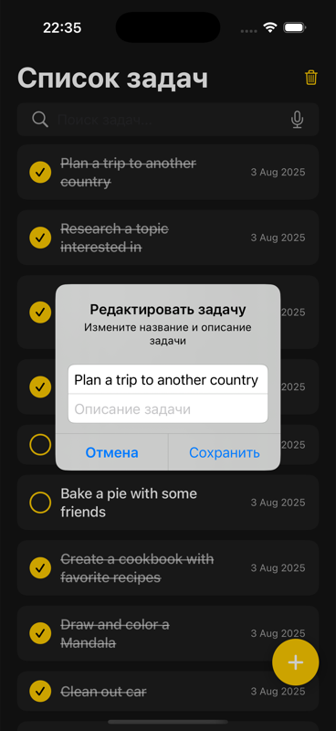
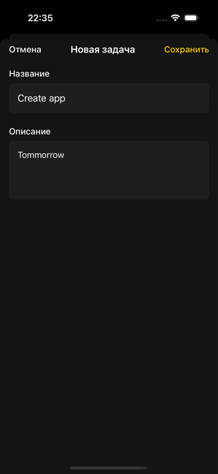

# To Do List iOS App

Приложение для управления списком задач, разработанное с использованием VIPER архитектуры.

## Функциональность

- ✅ Отображение списка задач
- ✅ Добавление новых задач
- ✅ Редактирование существующих задач
- ✅ Удаление задач
- ✅ Поиск по задачам
- ✅ Отметка задач как выполненных
- ✅ Загрузка данных с API при первом запуске
- ✅ Локальное хранение в CoreData
- ✅ Многопоточная обработка операций

## Архитектура

Приложение построено с использованием **VIPER архитектуры**:

- **View** - SwiftUI представления
- **Interactor** - бизнес-логика и работа с данными
- **Presenter** - управление данными между View и Interactor
- **Entity** - модели данных (CoreData)
- **Router** - навигация между экранами

## Структура проекта

```
To Do List/
├── Core/
│   ├── Models/
│   │   └── Task.swift
│   ├── Network/
│   │   ├── APIService.swift
│   │   └── TaskAPI.swift
│   └── Storage/
│       ├── CoreDataManager.swift
│       └── TaskStorage.swift
├── Modules/
│   ├── TaskList/
│   │   ├── TaskListView.swift
│   │   ├── TaskListPresenter.swift
│   │   ├── TaskListInteractor.swift
│   │   ├── TaskListRouter.swift
│   │   └── TaskListProtocols.swift
│   ├── TaskDetail/
│   │   ├── TaskDetailView.swift
│   │   ├── TaskDetailPresenter.swift
│   │   ├── TaskDetailInteractor.swift
│   │   ├── TaskDetailRouter.swift
│   │   └── TaskDetailProtocols.swift
│   └── AddTask/
│       ├── AddTaskView.swift
│       ├── AddTaskPresenter.swift
│       ├── AddTaskInteractor.swift
│       ├── AddTaskRouter.swift
│       └── AddTaskProtocols.swift
├── AppCoordinator.swift
├── Constants.swift
└── To_Do_ListApp.swift
```

## Скриншоты

<p float="left">
  
  
  
  
  
</p>

*Главный экран • Добавление задачи • Редактирование • Контекстное меню • Поиск*

## Технические требования

- iOS 15.0+
- Xcode 15.0+
- Swift 5.9+
- SwiftUI
- CoreData
- URLSession для сетевых запросов

## API

Приложение использует [DummyJSON API](https://dummyjson.com/todos) для загрузки начальных данных.

## Установка и запуск

1. Клонируйте репозиторий
2. Откройте проект в Xcode 15
3. Выберите симулятор или устройство
4. Нажмите Run (⌘+R)

## Тестирование

Проект включает Unit тесты для основных компонентов VIPER архитектуры:

```bash
# Запуск тестов
⌘+U в Xcode
```

## Особенности реализации

### Многопоточность
- Все операции с данными выполняются в фоновых потоках
- UI не блокируется во время операций
- Использование GCD для асинхронных операций

### CoreData
- Локальное хранение задач
- Автоматическое восстановление данных при перезапуске
- Оптимизированные запросы для поиска

### Навигация
- SwiftUI NavigationStack
- Программная навигация между модулями
- Передача данных между экранами

### Обработка ошибок
- Пользовательские уведомления об ошибках
- Graceful degradation при сбоях сети
- Валидация пользовательского ввода

## Лицензия

MIT License 